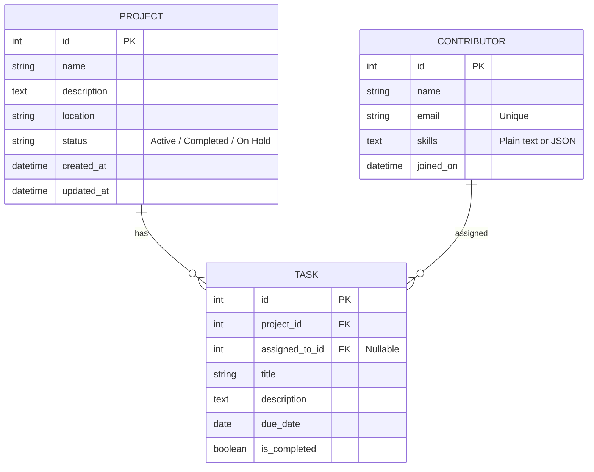

# Sustainability Projects Tracker API & Dashboard

A professional Django REST API and dynamic frontend dashboard designed to manage community sustainability projects, tasks, and contributors. Built as part of a Python/Django Developer take-home assignment.

---

## 🚀 Key Features

- **Relational MySQL Database Schema:** Clean relationships mapping projects, tasks, and contributors.
- **RESTful API Endpoints:** Structured Django REST Framework CRUD endpoints with built-in search, filtering, and pagination.
- **Resilient Redis Caching:** Responses are cached in Redis to optimize performance. Includes **dynamic runtime fallback** to local memory cache (`LocMemCache`) if the Redis service is offline, and **automated signal-based cache invalidation** on database writes.
- **Premium Single-Page Dashboard:** Interactive frontend built with HTML, Tailwind CSS, FontAwesome, and vanilla AJAX, featuring CRUD modals, real-time filters, stats summary, and color-coded status indicators.
- **Automated Test Suite:** Complete unit and integration tests verifying serializers, database constraints, filters, and cache behaviors.

---

## 🛠️ Tech Stack

- **Backend:** Python 3.14, Django 5.2, Django REST Framework
- **Database:** MySQL 8.0, PyMySQL (pure Python connector)
- **Caching:** Redis, `django-redis`
- **Frontend:** HTML5, Vanilla JavaScript, Tailwind CSS (via CDN)
- **Environment:** `django-environ` for secure configuration variables

---

## 💾 Database Schema Design

The application implements a relational database structure designed to track community efforts. The models reside in `projects/models.py`:



### Design Decisions:
- **`Project`:** Stores metadata for the sustainability project. The `status` field is restricted to choices (`Active`, `Completed`, `On Hold`) for integrity.
- **`Contributor`:** Holds volunteer details. The `email` field is enforced unique to prevent duplicate contributor entries.
- **`Task`:** Represents a singular action item. 
  - It belongs to a `Project` (with `models.CASCADE`, so removing a project cleans up its tasks).
  - It can be assigned to a `Contributor` (with `models.SET_NULL`, so removing a contributor keeps the task intact but marks it as unassigned).

---

## ⚡ Caching Design Decisions

To optimize response times for high-traffic list and detail lookups, we integrated caching with the following architecture:

1. **Dynamic Backend Fallback:** 
   In `settings.py`, Django pings Redis during startup. If Redis is down, it prints a console warning and dynamically redirects cache queries to Django's in-memory `LocMemCache`. This prevents application crashes and guarantees the API runs out-of-the-box in any environment.
2. **Query Parameter-Based Key Generation:**
   The `CacheResponseMixin` hashes query parameters (filters, page number, sorting) to ensure distinct request outputs are cached under unique keys.
3. **Automated Signal-Based Invalidation:**
   Django signals (`post_save`, `post_delete` in `projects/signals.py`) watch all three models. Whenever a project, contributor, or task is created, updated, or deleted, `cache.clear()` is called. This guarantees clients always view fresh data without complex key tracking overhead.

---

## 🔌 API Endpoints List

All endpoints are paginated (10 items per page) and prefixed with `/api/`.

| Method | Endpoint | Query Parameters | Description |
| :--- | :--- | :--- | :--- |
| **GET** | `/api/projects/` | `status` (Active, Completed, On Hold) | List all projects (ordered by created date) |
| **POST** | `/api/projects/` | *None* | Create a new project |
| **GET** | `/api/projects/<id>/` | *None* | Retrieve project details |
| **PUT/PATCH** | `/api/projects/<id>/` | *None* | Update an existing project |
| **DELETE** | `/api/projects/<id>/` | *None* | Delete a project and its tasks |
| **GET** | `/api/contributors/` | *None* | List all contributors |
| **POST** | `/api/contributors/` | *None* | Create a new contributor |
| **GET** | `/api/contributors/<id>/` | *None* | Retrieve contributor details |
| **PUT/PATCH** | `/api/contributors/<id>/` | *None* | Update a contributor |
| **DELETE** | `/api/contributors/<id>/` | *None* | Remove a contributor |
| **GET** | `/api/tasks/` | `contributor` (ID), `overdue` (`true`/`false`) | List tasks (ordered by due date) |
| **POST** | `/api/tasks/` | *None* | Create a new task |
| **GET** | `/api/tasks/<id>/` | *None* | Retrieve task details (includes computed `is_overdue` flag) |
| **PUT/PATCH** | `/api/tasks/<id>/` | *None* | Update a task (e.g. toggle completion) |
| **DELETE** | `/api/tasks/<id>/` | *None* | Delete a task |

---

## ⚙️ Installation & Setup Instructions

### Prerequisites
- Python 3.8+ (Tested on Python 3.14)
- MySQL Server (Ensure your local MySQL service is running)
- Redis Server (Optional, backend falls back to local memory if offline)

### Step 1: Clone and Prepare Workspace
```bash
git clone https://github.com/harish-jiji/sustainability-projects-tracker-api.git
cd sustainability-projects-tracker-api
```

### Step 2: Initialize Virtual Environment
```bash
# Create venv
python -m venv .venv

# Activate venv (Windows)
.venv\Scripts\activate

# Activate venv (macOS/Linux)
source .venv/bin/activate
```

### Step 3: Install Dependencies
```bash
pip install -r requirements.txt
```

### Step 4: Configure Environment Variables
Copy `.env.example` to create your local `.env` configuration:
```bash
copy .env.example .env
```
Open `.env` and fill in your local MySQL root password:
```env
DB_PASSWORD=your_mysql_root_password
```

### Step 5: Database Setup
Connect to your local MySQL shell and run:
```sql
CREATE DATABASE IF NOT EXISTS sustainability_tracker;
```

### Step 6: Apply Migrations & Run Server
```bash
# Run schema migrations
python manage.py migrate

# Start development server
python manage.py runserver
```
Visit **[http://127.0.0.1:8000/](http://127.0.0.1:8000/)** in your browser to view the interactive dashboard!

---

## 🧪 Running Unit Tests

Automated unit tests check CRUD behaviors, uniqueness constraints, filters, and cache invalidation. To execute them:
```bash
python manage.py test
```
