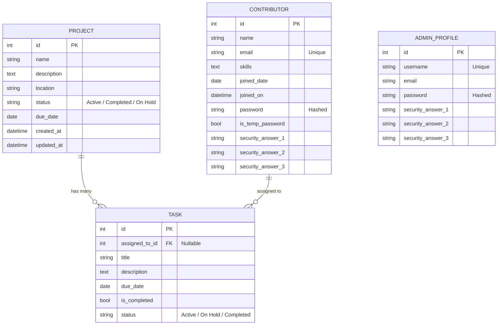

# 🌱 Sustainability Projects Tracker API & Dashboard

A professional Django REST API and dynamic single-page dashboard for managing community sustainability projects, tasks, and contributors. Features a complete dual-role authentication system (Admin & Staff), CSRF protection, contributor skill-based recommendations, and a fully role-aware frontend.

---

## 🚀 Key Features

- **Dual-Role Authentication** — Separate login flows for Admins and Staff Members (contributors) using session-based auth.
- **Temp Password Onboarding** — New staff log in with a temporary password and are forced to set a permanent one on first login.
- **Forgot Password via Security Questions** — Three built-in recovery questions replace email OTP for offline environments.
- **Admin Self-Management** — Admins can add/delete other admins with a safety guard: the last remaining admin cannot be deleted.
- **Contributor Skill Recommendations** — When assigning a task, the system recommends contributors whose skills match the project's name/description.
- **Role-Based UI** — Staff and Admin see entirely different interfaces: staff cannot edit projects, see only their own tasks (no contributor filter), and use a compact task-update modal.
- **Resilient Redis Caching** — Responses cached in Redis with automatic fallback to `LocMemCache` if Redis is offline. Signal-based cache invalidation on every DB write.
- **CSRF Protection** — Global fetch interceptor automatically sends `X-CSRFToken` cookie headers on all modifying requests.
- **14 Automated Unit Tests** — Covering auth, CRUD, permissions, settings, and admin management constraints.

---

## 🛠️ Tech Stack

| Layer | Technology |
|---|---|
| Backend | Python 3.14, Django 5.2, Django REST Framework |
| Database | MySQL 8.0, PyMySQL |
| Caching | Redis, `django-redis` (LocMemCache fallback) |
| Frontend | HTML5, Vanilla JavaScript, Tailwind CSS (CDN), FontAwesome |
| Auth | Custom session-based (no Django built-in `User` for staff) |
| Environment | `django-environ` |

---

## 💾 Database Schema



### Design Decisions

- **`Project`** — `status` restricted to `(Active, Completed, On Hold)` for data integrity.
- **`Contributor`** — `email` is unique. Stores a hashed password, `is_temp_password` flag for first-login enforcement, and three security answers (normalized to lowercase for case-insensitive matching).
- **`Task`** — Many-to-many with `Project` (a task can span multiple projects). Assigned to a contributor via `SET_NULL` (task survives if contributor is removed).
- **`AdminProfile`** — Wraps Django's `User` model for admin accounts with added security answer fields.

---

## 🔌 API Endpoints

All endpoints are prefixed with `/api/` and paginated (10 items/page by default).

### Authentication Endpoints

| Method | Endpoint | Description |
|:---|:---|:---|
| `POST` | `/api/auth/login/` | Log in as admin or staff. Body: `{user_type, username/email, password}` |
| `POST` | `/api/auth/logout/` | Destroy the current session |
| `GET` | `/api/auth/me/` | Get current logged-in user info |
| `POST` | `/api/auth/change-temp-password/` | Staff first-login: set a permanent password |
| `POST` | `/api/auth/forgot-password/` | Reset password using security answers |
| `POST` | `/api/auth/settings/` | Update profile (name, email, username, password, security answers) |

### Resource Endpoints

| Method | Endpoint | Query Params | Permission | Description |
|:---|:---|:---|:---|:---|
| `GET` | `/api/projects/` | `status` | Auth | List projects (ordered by created date) |
| `POST` | `/api/projects/` | — | Admin | Create a new project |
| `GET` | `/api/projects/<id>/` | — | Auth | Retrieve project details |
| `PUT/PATCH` | `/api/projects/<id>/` | — | Auth (Staff: status only) | Update a project |
| `DELETE` | `/api/projects/<id>/` | — | Admin | Delete a project and its tasks |
| `GET` | `/api/contributors/` | — | Auth | List all staff/contributors |
| `POST` | `/api/contributors/` | — | Admin | Add a new staff member |
| `GET` | `/api/contributors/<id>/` | — | Auth | Get contributor details |
| `PUT/PATCH` | `/api/contributors/<id>/` | — | Admin | Update contributor info |
| `DELETE` | `/api/contributors/<id>/` | — | Admin | Remove a contributor |
| `GET` | `/api/tasks/` | `contributor`, `overdue` | Auth | List tasks (admin: all, staff: own only) |
| `POST` | `/api/tasks/` | — | Admin | Create a new task |
| `GET` | `/api/tasks/<id>/` | — | Auth | Retrieve task details (includes `is_overdue`) |
| `PUT/PATCH` | `/api/tasks/<id>/` | — | Auth (Staff: status/completion only) | Update a task |
| `DELETE` | `/api/tasks/<id>/` | — | Admin | Delete a task |
| `GET` | `/api/admins/` | — | Admin | List all admin accounts |
| `POST` | `/api/admins/` | — | Admin | Create a new admin account |
| `DELETE` | `/api/admins/<id>/` | — | Admin | Delete an admin (cannot delete the last admin) |

---

## 🔐 Authentication System

### Admin Login
- Logs in with **username + password**.
- Managed by Django's `User` model extended with `AdminProfile`.
- Can manage all resources, add/delete other admins, and view all tasks.

### Staff (Contributor) Login
- Logs in with **email + password**.
- On first login (temp password), they are immediately redirected to set a permanent password.
- Staff can only view and update the status/completion of **their own tasks**.
- Staff cannot create, edit, or delete projects or contributors.

### Default Admin Account
When a fresh database is set up, run the setup command below to create the first admin:
```bash
python manage.py shell -c "
from django.contrib.auth.models import User
from projects.models import AdminProfile
u = User.objects.create_user('admin', 'admin@example.com', 'AdminPassword123')
u.is_superuser = True
u.is_staff = True
u.save()
AdminProfile.objects.create(user=u, email='admin@example.com')
print('Admin created: username=admin, password=AdminPassword123')
"
```
> **Important:** Change the default password immediately after first login via the Settings page.

### Adding More Admins
Logged-in admins can add additional admin accounts directly from the **Settings → Administrators** panel in the dashboard UI, or via the `/api/admins/` endpoint.

### Forgot Password Flow
1. On the login page, click **Forgot Password**.
2. Enter your username (admin) or email (staff).
3. Answer all three security questions set during account setup.
4. If answers match, enter and confirm your new password.
5. You are redirected to login with the new password.

---

## ⭐ Contributor Recommendation System

When creating or editing a task, the **Assignee** dropdown automatically recommends contributors whose skills match the selected project:

- The system compares each contributor's skill tags against the project's **name + description**.
- Matching contributors are labelled with `⭐ (Recommended: skill1, skill2)` in the dropdown.
- A highlighted chip panel below the dropdown shows all recommended contributors with one-click selection.
- Skills are set (comma-separated) when creating a contributor or via the staff's own Settings page.

---

## ⚡ Caching Architecture

1. **Dynamic Backend Fallback** — `settings.py` pings Redis at startup. If Redis is unavailable, the system falls back to `LocMemCache` and logs a warning. The API runs in any environment without crashing.
2. **Query-Parameter-Keyed Caching** — `CacheResponseMixin` hashes all query parameters (filters, pagination, sorting) into unique cache keys per request variant.
3. **Signal-Based Invalidation** — `post_save` and `post_delete` signals in `projects/signals.py` call `cache.clear()` whenever any `Project`, `Contributor`, or `Task` is modified, ensuring clients always receive fresh data.

---

## 🎨 Dashboard Features

### Admin Dashboard
| Section | What you can do |
|---|---|
| **Projects** | Create, edit, delete projects. Filter by status. View connected tasks and progress bar. |
| **Tasks** | Create, edit, delete tasks. Assign to contributors. Filter by contributor or overdue status. View task details in expandable rows. |
| **Staff** | Add, edit, delete contributors. Set skills, join date, temp password. View skill badges. |
| **Settings** | Change display name, email, username (unique check), password (requires current password). Set 3 security recovery questions. Manage admin accounts. |

### Staff Dashboard
| Section | What you can do |
|---|---|
| **Tasks** | View only your own assigned tasks. Click edit to open a compact update modal (Status + Completed toggle). |
| **Settings** | Change your name, email, skills. Change password (requires current password). Update security question answers. |

### UI Highlights
- 🌑 Dark mode with glassmorphism-style cards
- 📊 Real-time quick stats sidebar (total projects, tasks, overdue count)
- 🔔 Toast notifications for all actions (success/error/descriptive messages)
- 👁️ Password visibility toggle on all password inputs
- 📅 Date picker (Flatpickr) for due dates and joined dates
- 📄 Pagination on Projects, Tasks, and Staff lists
- 🔍 Expandable detail rows for tasks
- 🚫 Role-controlled button visibility (staff sees no edit/delete on projects)

---

## ⚙️ Installation & Setup

### Prerequisites — Install These First

Before setting up the project, make sure the following software is installed on your system:

| Software | Version | Download Link |
|---|---|---|
| **Python** | 3.10+ (tested on 3.14) | https://www.python.org/downloads/ |
| **MySQL** | 8.0+ | https://dev.mysql.com/downloads/installer/ |
| **Redis** *(optional)* | Any | https://redis.io/docs/getting-started/installation/ |
| **pip** | Latest | Bundled with Python |

> **Redis is optional.** If Redis is not installed, the server automatically falls back to in-memory caching with no extra configuration needed.

---

### 📦 Method A: Download as ZIP (No Git Required)

This is the recommended method if you simply want to run the project without version control.

#### Step 1: Download the ZIP

1. Go to the GitHub repository page:  
   `https://github.com/harish-jiji/sustainability-projects-tracker-api`
2. Click the green **`<> Code`** button.
3. Select **`Download ZIP`**.
4. Save the file (e.g., `sustainability-projects-tracker-api-main.zip`) to a location of your choice, such as your Desktop or `C:\Projects\`.

#### Step 2: Extract the ZIP

**Windows:**
1. Right-click the downloaded `.zip` file.
2. Select **Extract All…**
3. Choose a destination folder, for example: `C:\Projects\sustainability-tracker\`
4. Click **Extract**.
5. Open the extracted folder — you should see `manage.py`, `requirements.txt`, etc.

**macOS / Linux:**
```bash
unzip sustainability-projects-tracker-api-main.zip -d ~/Projects/sustainability-tracker/
cd ~/Projects/sustainability-tracker/sustainability-projects-tracker-api-main/
```

#### Step 3: Open a Terminal in the Project Folder

**Windows:**
- Open File Explorer, navigate to the extracted folder.
- Click the address bar, type `cmd`, and press Enter.
- *(Or right-click inside the folder → "Open in Terminal" if available.)*

**macOS / Linux:**
```bash
cd ~/Projects/sustainability-tracker/sustainability-projects-tracker-api-main/
```

#### Step 4: Create a Virtual Environment

A virtual environment keeps the project's Python packages isolated from the rest of your system.

```bash
# Create the virtual environment
python -m venv .venv
```

Then activate it:

```bash
# Windows (Command Prompt)
.venv\Scripts\activate

# Windows (PowerShell)
.venv\Scripts\Activate.ps1

# macOS / Linux
source .venv/bin/activate
```

> ✅ You'll know it's active when your terminal prompt shows `(.venv)` at the beginning.

#### Step 5: Install Python Dependencies

```bash
pip install -r requirements.txt
```

This installs Django, Django REST Framework, PyMySQL, Redis client, and all other required packages listed in `requirements.txt`.

Expected output (example):
```
Successfully installed Django-5.2.16 djangorestframework-3.17.1 PyMySQL-1.2.0 ...
```

#### Step 6: Set Up the Environment File

The project uses a `.env` file to store sensitive configuration (database password, secret key, etc.).

```bash
# Windows (Command Prompt)
copy .env.example .env

# Windows (PowerShell)
Copy-Item .env.example .env

# macOS / Linux
cp .env.example .env
```

Now open `.env` in any text editor (Notepad, VS Code, etc.) and fill in your values:

```env
# Django
DEBUG=True
SECRET_KEY=replace-this-with-a-long-random-string

# MySQL Database
DB_NAME=sustainability_tracker
DB_USER=root
DB_PASSWORD=your_mysql_password_here
DB_HOST=127.0.0.1
DB_PORT=3306

# Redis (optional — leave as-is if Redis is not installed)
REDIS_URL=redis://127.0.0.1:6379/1
```

> **Tip:** Generate a secure `SECRET_KEY` by running:
> ```bash
> python -c "from django.core.management.utils import get_random_secret_key; print(get_random_secret_key())"
> ```

#### Step 7: Create the MySQL Database

Open the MySQL command-line client or MySQL Workbench and run:

```sql
CREATE DATABASE IF NOT EXISTS sustainability_tracker CHARACTER SET utf8mb4 COLLATE utf8mb4_unicode_ci;
```

Make sure the `DB_USER` in your `.env` has privileges on this database:

```sql
GRANT ALL PRIVILEGES ON sustainability_tracker.* TO 'root'@'localhost';
FLUSH PRIVILEGES;
```

#### Step 8: Run Database Migrations

This creates all the required tables in your MySQL database:

```bash
python manage.py migrate
```

Expected output ends with:
```
Running migrations:
  Applying projects.0001_initial... OK
  ...
```

#### Step 9: Create the First Admin Account

Run this one-time command to create the default admin login:

```bash
python manage.py shell -c "
from django.contrib.auth.models import User
from projects.models import AdminProfile
u = User.objects.create_user('admin', 'admin@example.com', 'AdminPassword123')
u.is_superuser = True
u.is_staff = True
u.save()
AdminProfile.objects.create(user=u, email='admin@example.com')
print('✅ Admin created: username=admin, password=AdminPassword123')
"
```

> ⚠️ **Change this password immediately** after your first login via the Settings page in the dashboard.

#### Step 10: Start the Development Server

```bash
python manage.py runserver
```

Open your browser and go to:  
👉 **http://127.0.0.1:8000/**

Log in with:
- **Username:** `admin`
- **Password:** `AdminPassword123`

---

### 🔁 Method B: Clone with Git

If you have Git installed and prefer version control:

```bash
git clone https://github.com/harish-jiji/sustainability-projects-tracker-api.git
cd sustainability-projects-tracker-api
```

Then follow **Steps 4 through 10** from Method A above.

---

## 🔄 Stopping and Restarting the Server

To **stop** the server: press `Ctrl + C` in the terminal.

To **restart** it later, you only need to:
1. Re-activate the virtual environment:
   ```bash
   # Windows
   .venv\Scripts\activate
   # macOS/Linux
   source .venv/bin/activate
   ```
2. Run the server again:
   ```bash
   python manage.py runserver
   ```

---

## 🧪 Running Tests

The test suite covers 14 scenarios including: login, temp password change, forgot password, settings update with current-password verification, admin add/delete, and the self-delete safety constraint.

```bash
python manage.py test
```

Expected output:
```
Ran 14 tests in ~5s
OK
```

---

## ❗ Troubleshooting

| Problem | Solution |
|---|---|
| `ModuleNotFoundError` | Make sure your virtual environment is activated (`(.venv)` in prompt) and you ran `pip install -r requirements.txt`. |
| `django.db.utils.OperationalError` (Can't connect to MySQL) | Check that MySQL is running, and that `DB_HOST`, `DB_USER`, `DB_PASSWORD`, and `DB_PORT` in `.env` are correct. |
| `django.core.exceptions.ImproperlyConfigured` (SECRET_KEY) | Make sure you copied `.env.example` to `.env` and set a valid `SECRET_KEY`. |
| `.venv\Scripts\Activate.ps1 cannot be loaded` (PowerShell) | Run `Set-ExecutionPolicy -Scope CurrentUser RemoteSigned` and try again. |
| Redis connection error on startup | This is non-fatal. The server prints a warning and automatically uses in-memory cache. You can safely ignore this if Redis is not installed. |
| Port 8000 already in use | Run on a different port: `python manage.py runserver 8080` |
| `Access denied for user 'root'` (MySQL) | Verify your MySQL password in `.env`. If using XAMPP/WAMP, the default root password may be empty — leave `DB_PASSWORD=` blank. |

---

## 📁 Project Structure

```
sustainability-projects-tracker-api/
├── manage.py
├── requirements.txt
├── .env.example             ← Copy this to .env and fill in your values
├── sustainability_tracker/
│   ├── settings.py          # Redis fallback, REST framework config
│   └── urls.py              # Root URL routing
├── projects/
│   ├── models.py            # Project, Contributor, Task, AdminProfile
│   ├── serializers.py       # DRF serializers with validation
│   ├── views.py             # ProjectViewSet, ContributorViewSet, TaskViewSet
│   ├── views_auth.py        # Auth endpoints + AdminViewSet
│   ├── urls.py              # API route registration
│   ├── signals.py           # Cache invalidation signals
│   └── tests.py             # 14 automated tests
├── templates/
│   ├── index.html           # Main SPA shell (login + dashboard)
│   └── components/
│       ├── header.html      # Top nav bar
│       ├── sidebar.html     # Role-based nav sidebar
│       ├── projects.html    # Projects tab content
│       ├── tasks.html       # Tasks tab content
│       ├── contributors.html # Staff tab content
│       └── modals.html      # All modal dialogs
└── static/
    └── js/
        └── app.js           # All frontend JS logic
```

---

## 🛡️ Security Notes

- All passwords are stored **hashed** using Django's `make_password` (PBKDF2-SHA256).
- Security question answers are normalized to **lowercase** before hashing to allow case-insensitive recovery.
- CSRF tokens are automatically injected into every modifying API request via a global fetch interceptor.
- Session cookies use Django's default secure session framework.
- Staff users are strictly limited to read and partial-update access on their own tasks only.
